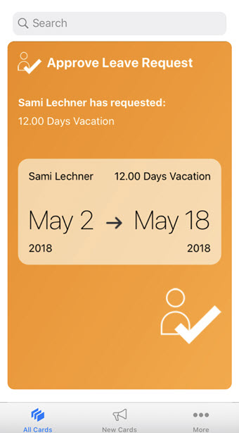

# Approve Leave Request Card

## Description

Approve Leave Request Card gives you the details of the leaves requested by an employee.
You can see the Employee Name, Leave Type, Leave Date, Number of Days and you can either Accept or Reject the leave requested.

## URL

The default connection of the card template must be configured in Mobile Services Cockpit.

However, you can still experience how the card would function on your mobile device.
You can change the lifecycle status of your card to [Prototype Mode](https://help.sap.com/doc/f53c64b93e5140918d676b927a3cd65b/Cloud/en-US/docs-en/guides/getting-started/mck/mck-managing-cards.html#prototype) to visualize the data from `userdata.json` file.

### Deploying The Card As A Prototype From Business Application Studio

### Making The Card A Prototype Card on Mobile Services Cockpit

## Screenshot

### Android

#### Front

#### Back

Approve Leave Request Card does not have template_back_en.html. Therefore, you cannot see the flip option to view back side of the Card in Android.

### iOS

#### Front

#### Back

Approve Leave Request Card does not have template_back_en.html. Therefore, this is how the Card would look like after flipping.

