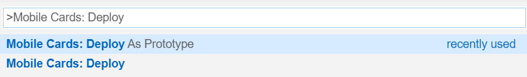
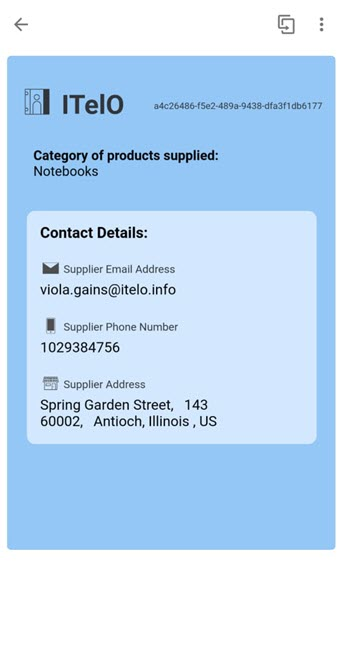
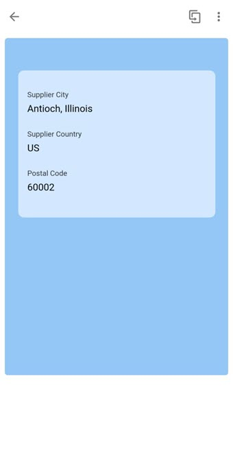
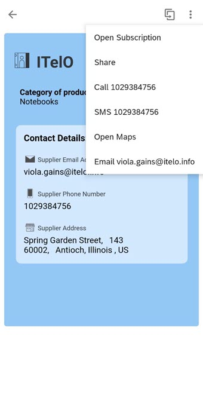
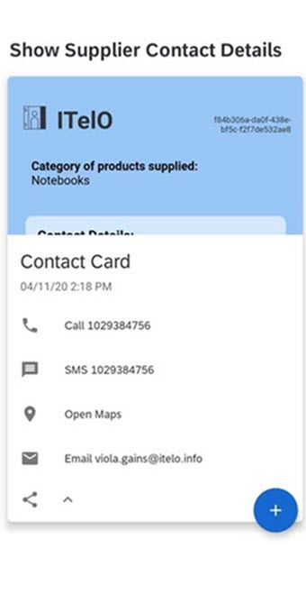
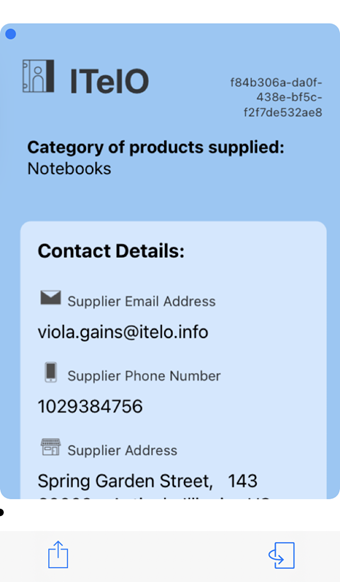
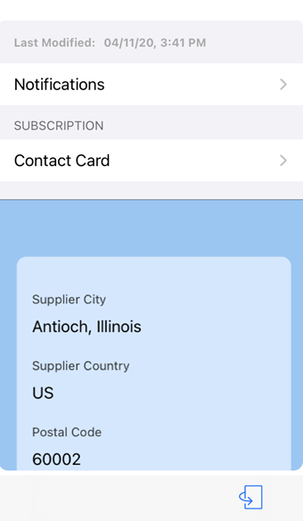
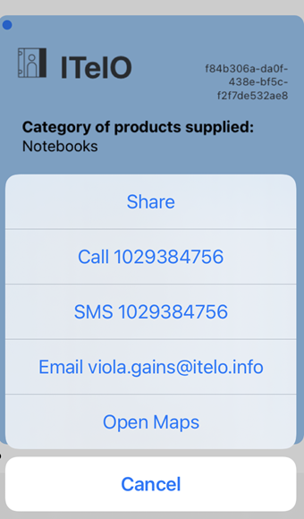

# Contact Card

## Description

Contact Card makes it easy for you to contact your suppliers, without having to feed the details in the contacts app on your phone.
You simply open the card of the supplier whom you wish to contact and use the actions provided by the card to call them, send a text/e-mail message or navigate to their location.

## URL

The default connection of the card template must be configured in SAP Mobile Services Cockpit.

However, you can still experience how the card would function on your mobile device.
You can change the lifecycle status of your card to [Prototype Mode](https://help.sap.com/doc/f53c64b93e5140918d676b927a3cd65b/Cloud/en-US/docs-en/guides/getting-started/mck/mck-managing-cards.html#prototype) to visualize the data from `userdata.json` file.

### Deploying the Card as a Prototype from SAP Business Application Studio

### Making the card a Prototype card on SAP Mobile Services Cockpit

## Screenshot

### Android

#### Front

#### Back

 

### iOS

#### Front

#### Back

