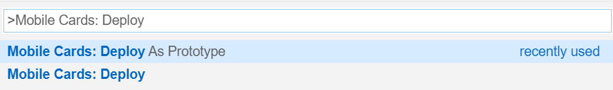
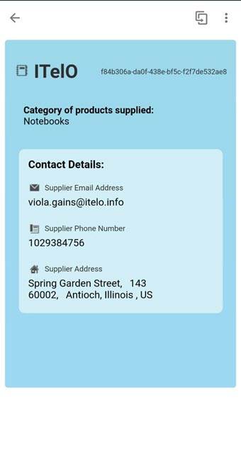
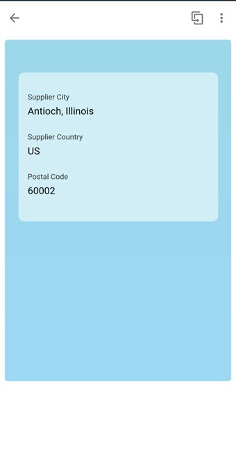
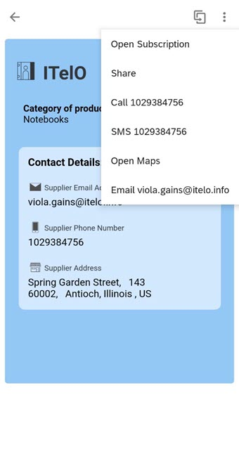
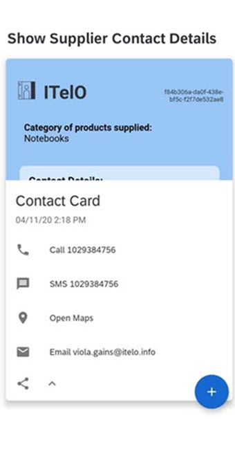
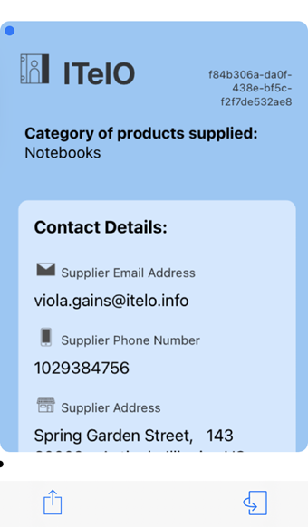
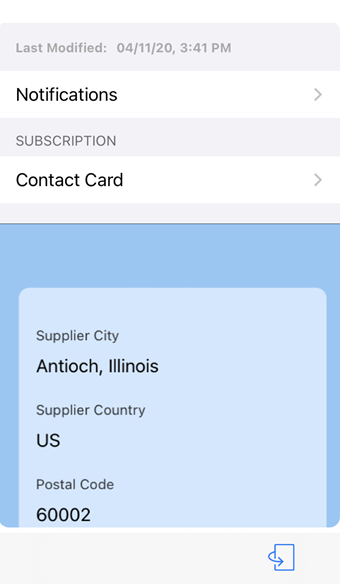
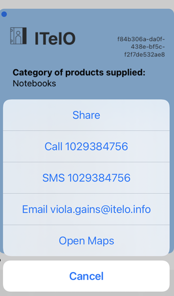

# Contact Card

## Description

Contact Card gives you the contact details of the suppliers.
You can call the supplier, text the supplier, email them, open maps. You can see the category of products they supply.

## URL

The card in Prototype Mode renders the data from the userdata.json file on your physical mobile device.
You can change the lifecycle status of your card to Prototype Mode to visualize the data from userdata.json file.

### Deploying The Card As A Prototype From Business Application Studio

### Making The Card A Prototype Card on Mobile Services Cockpit 

## Screenshot

### Android

#### Front

#### Back

 

### iOS

#### Front

#### Back

