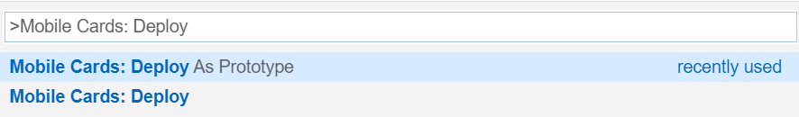
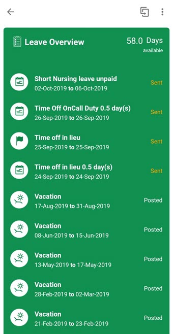
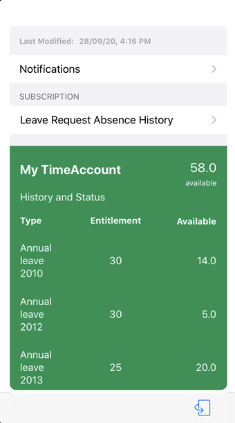

# Leave Request Card

## Description

Leave Request Card gives the status of the leaves requested in the past and an overview of the number of leaves currently available to the employee.
You can see the Leave Type, Leave Date, Available Leaves and Status of Leave requested among other details. You can also create a leave request.

## URL

The default connection of the card template must be configured in Mobile Services Cockpit.

However, you can still experience how the card would function on your mobile device.
You can change the lifecycle status of your card to [Prototype Mode](https://help.sap.com/doc/f53c64b93e5140918d676b927a3cd65b/Cloud/en-US/docs-en/guides/getting-started/mck/mck-managing-cards.html#prototype) to visualize the data from `userdata.json` file.

### Deploying The Card As A Prototype From Business Application Studio

### Making The Card A Prototype Card on Mobile Services Cockpit

## Screenshot

### Android

#### Front

#### Back

### iOS

#### Front

#### Back

