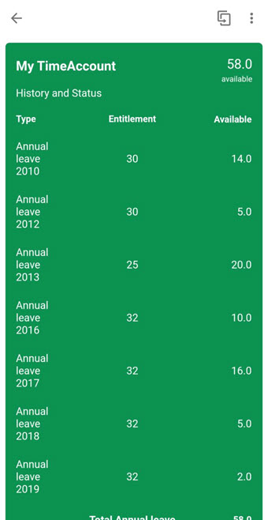

# Leave Request Card

## Description

Leave Request Card gives the status of the requested - leave requests of the past and an overview of the leave days the employee has left.
You can see the Leave Type, Leave Date, Available Leaves and Status of Leave requested among other details. You can also create leave request.

## URL

The card in Prototype Mode renders the data from the userdata.json file on your physical mobile device.
You can change the lifecycle status of your card to Prototype Mode to visualize the data from userdata.json file.

### Deploying The Card As A Prototype From Business Application Studio

### Making The Card A Prototype Card on Mobile Services Cockpit 

## Screenshot

### Android

#### Front

#### Back

### iOS

#### Front

#### Back

