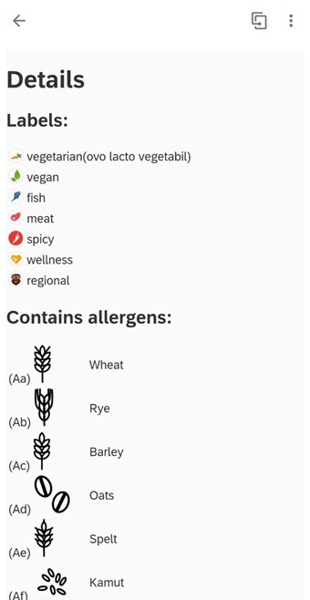
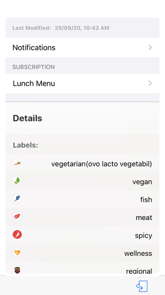

## Lunch Menu Card

## Description

Lunch Menu Card gives you the details of the menu served by the canteen. You can view Lunch Date, menu served along with allergens present.

## URL

The card in Prototype Mode renders the data from the userdata.json file on your physical mobile device.
You can change the lifecycle status of your card to Prototype Mode to visualize the data from userdata.json file.

You can also create your own sample service by following the exercises given in the openSAP course '[Build Mobile Applications with SAP Cloud Platform Mobile Services](https://open.sap.com/courses/mobile3/items/4FJCVzyMnrDRsOWJ5MZuIY)'.

### Deploying The Card As A Prototype From Business Application Studio

### Making The Card A Prototype Card on Mobile Services Cockpit 

## Screenshot

### Android

#### Front

#### Back

### iOS

#### Front

#### Back

