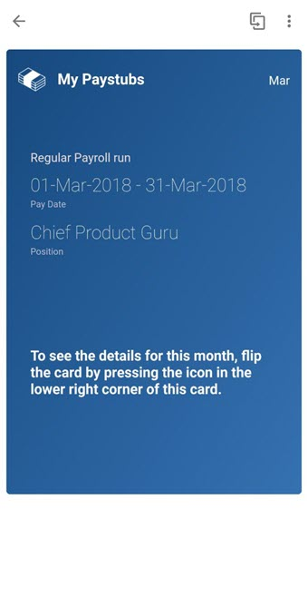
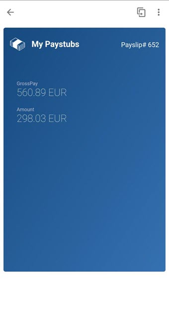
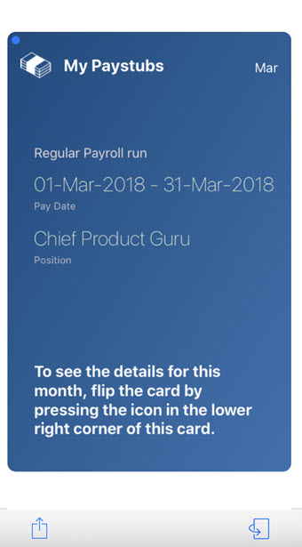
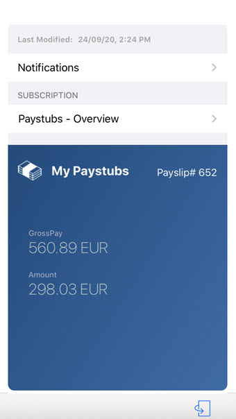

## My Paycheck Card

## Description

My Paycheck Card gives you the details of the Payroll run. You can view Pay Date, Position, the GrossPay and Amount for a particular month.

## URL

The card in Prototype Mode renders the data from the userdata.json file on your physical mobile device.
You can change the lifecycle status of your card to Prototype Mode to visualize the data from userdata.json file.

### Deploying The Card As A Prototype From Business Application Studio

### Making The Card A Prototype Card on Mobile Services Cockpit 

## Screenshot

### Android

#### Front

#### Back

### iOS

#### Front

#### Back

