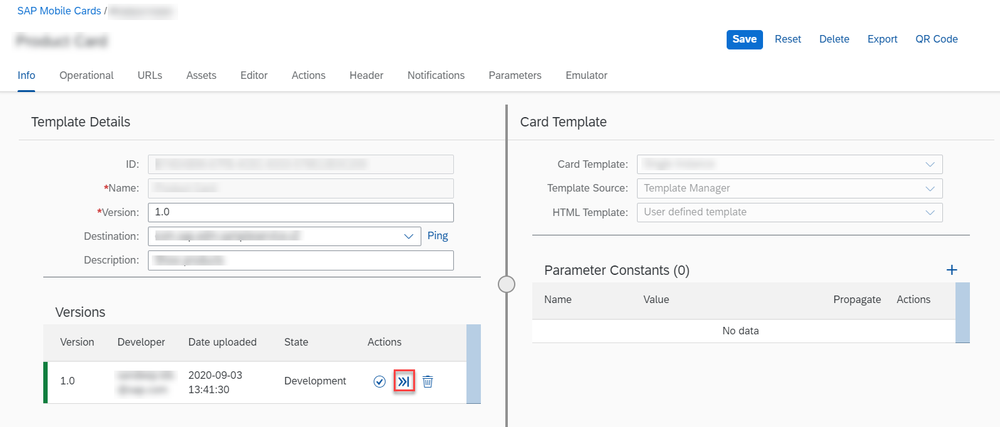
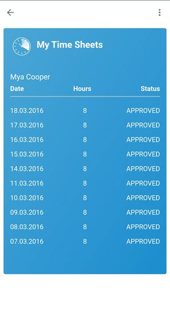
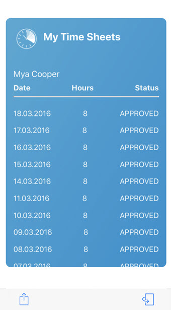
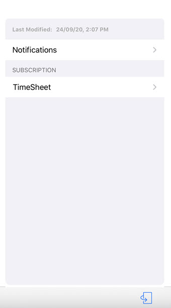

# My Time Sheet Card

## Description

Time Sheet Card keeps a record of your work activity. You can see the Name, Date, Number of Hours and the status of your timesheet request.

## URL

The card in Prototype Mode renders the data from the userdata.json file on your physical mobile device.
You can change the lifecycle status of your card to Prototype Mode to visualize the data from userdata.json file.

### Deploying The Card As A Prototype From Business Application Studio

### Making The Card A Prototype Card on Mobile Services Cockpit 

## Screenshot

### Android

#### Front

#### Back
Time Sheet Card does not have template_back_en.html. Therefore, you cannot see the flip option to view back side of the Card in Android.

### iOS

#### Front

#### Back

Time Sheet Card does not have template_back_en.html. Therefore, this is how the Card would look like after flipping.

