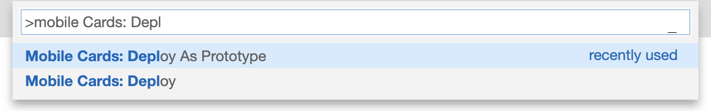
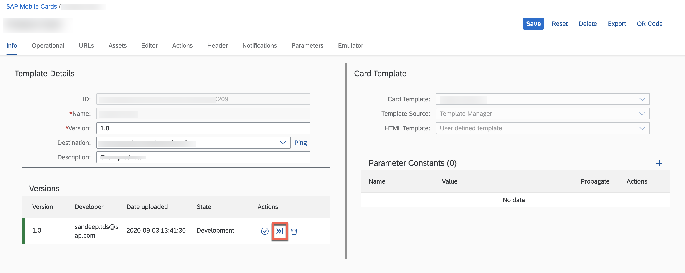
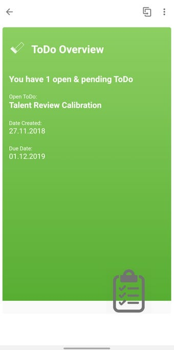
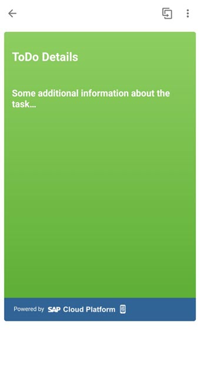
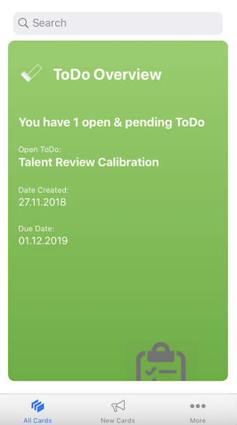
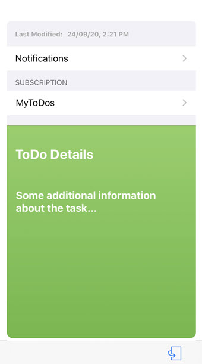

# To Do Card

## Description

To Do card let's you put your action items in your pocket. Each To Do appears as a different card. On each card you can see the action item, date the action item was created and date when you are due to complete your action.

## URL

The default connection of the card template must be configured in SAP Mobile Services Cockpit.

However, you can still experience how the card would function on your mobile device.
You can change the lifecycle status of your card to [Prototype Mode](https://help.sap.com/doc/f53c64b93e5140918d676b927a3cd65b/Cloud/en-US/docs-en/guides/getting-started/mck/mck-managing-cards.html#prototype) to visualize the data from `userdata.json` file.

### Deploying the card as a Prototype Card from SAP Business Application Studio

### Making the card a Prototype card on SAP Mobile Services Cockpit

## Screenshot

### Android

#### Front

#### Back

### iOS

#### Front

#### Back

