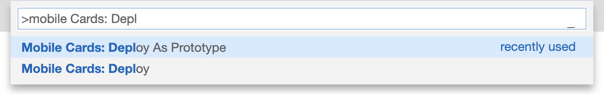

# Product Card

## Description

To Do card is a card that let's you put your action items in your pocket. Each To Do appears as a different card. On each card you can see the action item, date the action item was created and date when you are due to complete your action. 

## URL

The default URL used by the card is a SuccessFactors demo API. Please click here to configure a sample service from API Management service on your Mobile Services account. 

Alternatively, you can change the life cycle status of the card to Protytype Mode to see the card render data from the userdata.json file on your physical mobile device. 

### Deploying The Card As A Prototype Card From Business Application Studio

### Making The Card A Prototype Card on Mobile Services Cockpit 

## Screenshot

### Android

### iOS

 