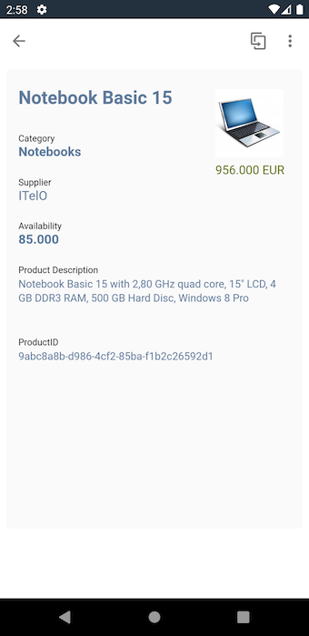
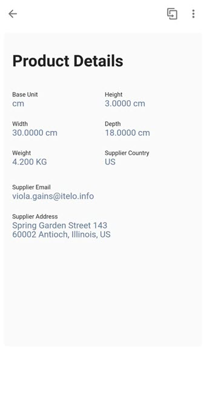
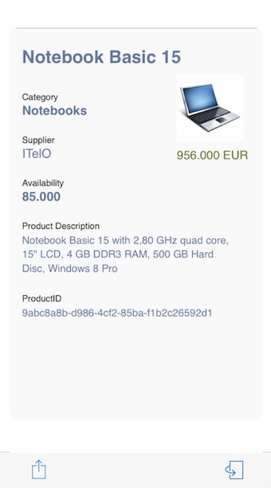
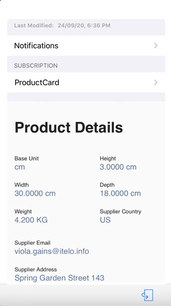

# Product Card

## Description

Product Card is a card that mobilizes your Product details seamlessly. You can see the Product Name, Supplied Name, Units Available, Price, Product Id, and Product Description among other details.

## URL

We define a URL to show a card for a specific product present in the [Sample OData Service.](https://help.sap.com/doc/f53c64b93e5140918d676b927a3cd65b/Cloud/en-US/docs-en/guides/features/backend-connectivity/sample.html) ,i.e. Notebook Basic 15.

## Screenshot

### Android

#### Front

#### Back

### iOS

#### Front

#### Back

