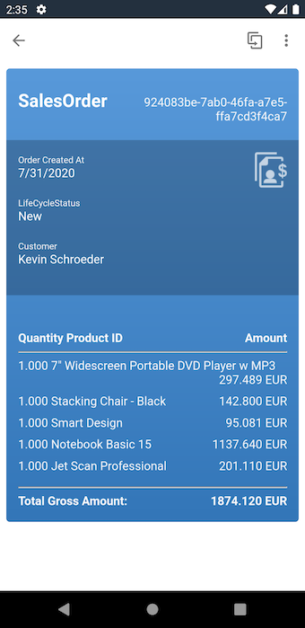
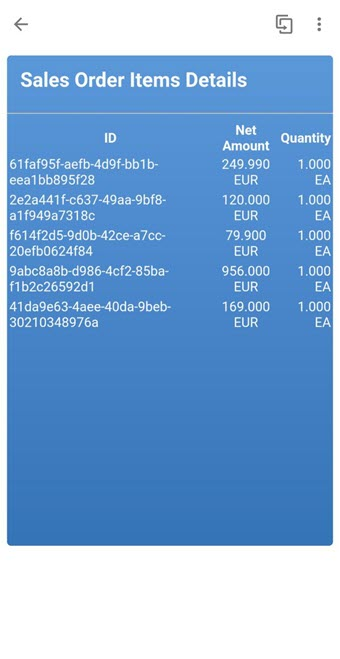
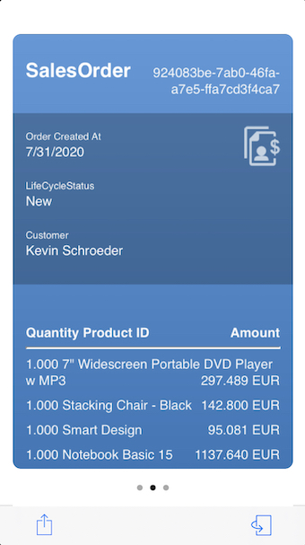
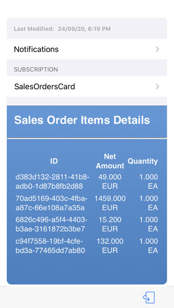

# SalesOrderHeaders Card

## Description

SalesOrderHeader Card is a card that mobilizes your Sales Order data seamlessly. You can see the SalesOrderId, Creation Date, Items Ordered, and Price of the order. Additionally, you can see the customer details of the order.

## URL

We define a URL to show 3 sales orders each of which is presented as a card present in the [Sample OData Service.](https://help.sap.com/doc/f53c64b93e5140918d676b927a3cd65b/Cloud/en-US/docs-en/guides/features/backend-connectivity/sample.html)

## Screenshot

### Android

#### Front

#### Back

### iOS

#### Front

#### Back

