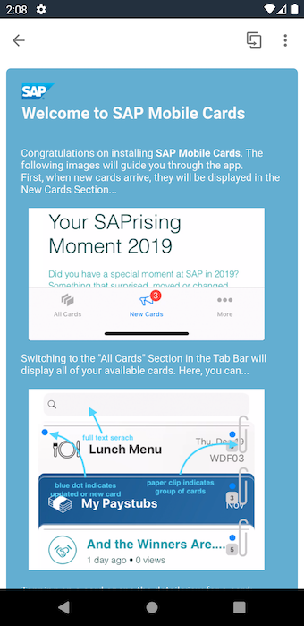
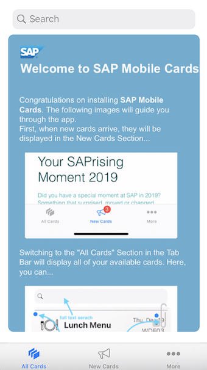

# Welcome Card

## Description

Welcome Card shows a card explaining the basics of the SAP Mobile Cards client. It is an automatically subscribed card. Users can unsubscribe from it.

It creates one card for each user.

## URL

Welcome cards are static cards that don't need a URL connection.

## Screenshot

### Android

#### Front

#### Back

### iOS

#### Front

#### Back

## License

This project is licensed under the Apache Software License, version 2.0 except as noted otherwise in the [LICENSE](../LICENSES/Apache-2.0.txt) file.

Copyright (c) 2020 SAP SE or an SAP affiliate company. All rights reserved.
